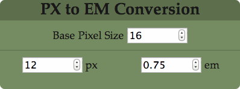

# Pixel to em widget for OSX Dashboard

Converts pixel values to em values and vice-versa using a base font size.

## Install

From the root directory, run `./build.sh` from a terminal window. This will create a widget file called **pixeltoem.wdgt** from the `src` directory contents that can then be installed by double-clicking on it in Finder.

(If terminal gives a `Permission denied` error run `chmod u+x build.sh` and try again).